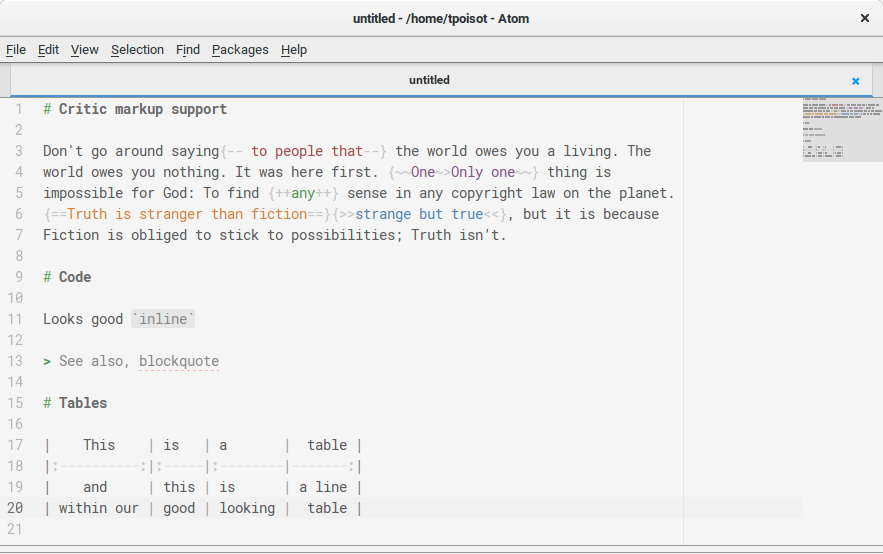
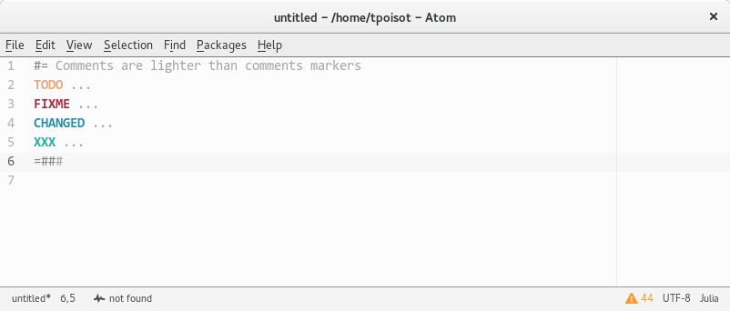
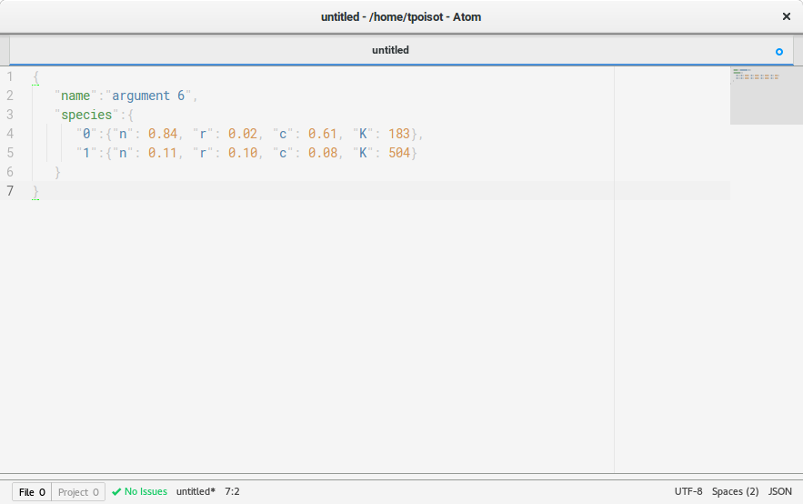

# writer-syntax theme

## Main features

- A lot of `gfm` support, including tables and CriticMarkup
- Highlighting of `FIXME`, `TODO`, `CHANGED`, and `XXX`
- Good looking comments!
- Support for `diff`
- Support for `indent-guide-improved`
- Support for `json`

## Screenshots

**Markdown**

**Comments**

**JSON**

**Indentation**

